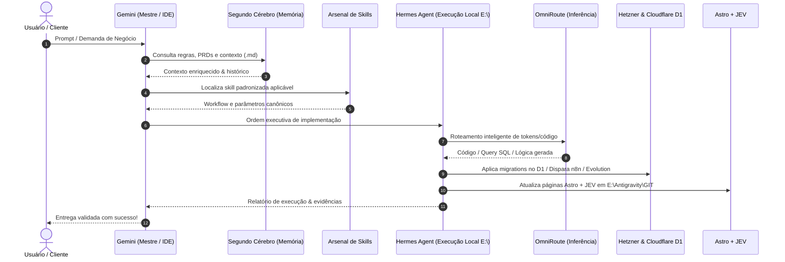

# A Stack Perfeita de IA em 2026

> **Fonte:** Vídeo do YouTube — *"Essa é a stack perfeita de IA em 2026 (só me copie)"*
> **Notebook NotebookLM:** `49f7cea6-90a1-459a-af86-823a8c2087e5`
> **Documentado em:** 2026-10-02
> **Autor da documentação:** Antigravity (AGY) via extração NotebookLM MCP

---

## Visão Geral

Esta stack foi desenvolvida e validada na prática pelo autor, que afirma ter:
- Criado **duas empresas** que geraram mais de **R$ 200.000**
- Construído **plataformas inteiras** sem contratar programadores
- Automatizado edição de vídeo, propostas comerciais e roteiros de conteúdo

O segredo está em combinar **memória persistente + habilidades padronizadas + time de agentes orquestrados + ferramentas externas** em quatro camadas complementares.

---

## Arquitetura: As 4 Camadas

```
┌─────────────────────────────────────────────────────┐
│  CAMADA 4: BRAÇOS (Ferramentas Externas)            │
│  WhatsApp · Supabase · Vercel · n8n · Instagram     │
├─────────────────────────────────────────────────────┤
│  CAMADA 3: ORQUESTRAÇÃO (Time de Agentes)           │
│  Maestre · Fable → Opus → GPT → Antigravity         │
├─────────────────────────────────────────────────────┤
│  CAMADA 2: SKILLS (Habilidades Padronizadas)        │
│  skill.md · workflows · regras · exemplos           │
├─────────────────────────────────────────────────────┤
│  CAMADA 1: MEMÓRIA (Segundo Cérebro)                │
│  Obsidian · claude.md · pastas .md locais           │
└─────────────────────────────────────────────────────┘
```

> Cada camada **resolve o limite da anterior**. Não pule etapas.

---

## CAMADA 1 — Memória Persistente (O Segundo Cérebro)

### Problema que resolve
A IA convencional começa toda conversa do zero. Você reexplica quem é, o que faz, quais são seus padrões — toda vez.

### Como funciona

O **Segundo Cérebro** é uma pasta local no computador com arquivos de texto (`.md`). A IA lê e grava informações continuamente nessa pasta.

**Ferramentas:**
- **Obsidian** — visualizador gráfico da estrutura de pastas (não é obrigatório, apenas facilita ver a "teia" crescendo)
- **Arquivos `.md` locais** — onde o conhecimento realmente fica armazenado
- **`claude.md`** — arquivo-mapa central que orienta a IA

### O Arquivo-Mapa (`claude.md`)

Este é o arquivo mais importante da stack. A cada nova conversa, a IA carrega apenas este arquivo e sabe exatamente onde buscar cada informação.

```markdown
# Exemplo de estrutura do claude.md

## Sobre mim
Nome, empresa, área de atuação...

## Estrutura do Segundo Cérebro
- /pessoas → fichas de clientes, parceiros, mentores
- /branding → paleta, fontes, logos, guias visuais
- /conteudo → carrosséis, lives, YouTube, ideias
- /negocios → preços, serviços, propostas
- /skills → habilidades padronizadas
```

**Por que isso barateia o custo?** Em vez de ler 3.000 linhas de um documento gigante toda vez, a IA lê apenas o mapa e vai diretamente ao arquivo necessário.

### Estrutura de Pastas Recomendada

```
📁 segundo-cerebro/
├── 📄 claude.md              ← MAPA CENTRAL (sempre carregado)
├── 📁 .cloud/
│   └── 📁 skills/            ← Habilidades padronizadas
│       ├── 📁 motion-designer/
│       ├── 📁 proposta-comercial/
│       └── 📁 roteiro-reels/
├── 📁 pessoas/
│   ├── joao-silva.md
│   └── maria-souza.md
├── 📁 branding/
│   ├── core-branding.md      ← fontes, cores, logos, exemplos
│   └── carrosséis/
├── 📁 negocios/
│   ├── precos.md
│   └── servicos.md
└── 📁 conteudo/
    ├── publicado/
    └── ideias/
```

### Exemplo Prático: Captura Dinâmica

**Situação:** Você diz ao Claude: _"Acabei de fechar um negócio com o João."_

**O que acontece:**
1. IA consulta a pasta `pessoas/`
2. Verifica se existe um arquivo `joao.md`
3. Se não existe → pergunta quem é o João
4. Cria o arquivo `joao.md` com nome, e-mail, WhatsApp, papel, projeto
5. Em conversas futuras → atualiza a ficha automaticamente conforme novas informações surgem

### Exemplo Prático: Branding

Com o branding armazenado em `branding/core-branding.md` (contendo fontes, paleta de cores, logos, hierarquia visual), um único prompt como _"cria um carrossel sobre X"_ já produz o resultado com a identidade visual exata — sem precisar explicar nada de design.

> **Resultado real:** Carrosséis com mais de 100.000 visualizações criados com 1 prompt, apenas porque o branding estava no segundo cérebro.

---

## CAMADA 2 — Skills (Habilidades Padronizadas)

### Problema que resolve
Memória sabe **quem você é**. Mas ainda falta ensinar **como você faz as coisas**.

### O que é uma Skill

Uma skill é um **processo padronizado e condensado em arquivo**. Você pega uma tarefa repetitiva, mapeia o passo a passo de como ela deve ser feita e transforma em um arquivo `.md` que a IA consulta toda vez que precisar executar essa tarefa.

### A Regra de Ouro: 3 Vezes

> **"Se eu fiz algo 3 vezes seguidas, vou transformar isso numa skill. Nunca vou fazer a quarta."**

### Estrutura de uma Skill

Cada skill fica em uma pasta dentro de `.cloud/skills/` e contém:

```
📁 .cloud/skills/proposta-comercial/
├── 📄 skill.md           ← ARQUIVO PRINCIPAL
├── 📁 exemplos/          ← Exemplos de referência
├── 📁 referencias/       ← Materiais de consulta
└── 📁 branding/          ← Guias visuais específicos
```

**O `skill.md` deve conter:**

```markdown
# Skill: Proposta Comercial

## Setup
Como inicializar esta skill...

## Fluxo de Trabalho
1. Consulte OBRIGATORIAMENTE /pessoas/{cliente}
2. Consulte OBRIGATORIAMENTE /negocios/precos.md
3. Analise o escopo da reunião
4. Monte a proposta no formato padrão

## Modos de Operação
- Modo Rápido: após reunião de 30min
- Modo Completo: projetos acima de R$10.000

## Regras Fixas
- NÃO envie proposta sem confirmar o nome correto do cliente
- SEMPRE incluir prazo de validade
- JAMAIS incluir preços sem verificar tabela atualizada
```

### 3 Exemplos Reais de Skills

#### 1. Roteiro de Reels
**Antes:** Pegar vídeo gringo → traduzir manualmente → adaptar para a voz → gravar  
**Depois:** 
- Envia 7 links de vídeos de referência do Instagram
- IA baixa, transcreve, adapta ao tom de voz, cria roteiro pronto
- **Resultado instantâneo**, sem trabalho manual

#### 2. Proposta Comercial
**Antes:** Gravar reunião → entender projeto → criar escopo → risco de não fechar  
**Depois:**
- IA sai da reunião e já monta a proposta automaticamente
- Consulta ficha do cliente no segundo cérebro
- Aplica preços da tabela atualizada

#### 3. Motion Designer / Edição de Vídeo
**Antes:** Pagar editor, aguardar 24 horas  
**Depois:**
- Termina de gravar → **20 minutos** → vídeo editado pronto
- Custo zero
- Skill carrega: referências de movimento, estilos de animação, regras visuais do branding

---

## CAMADA 3 — Orquestração (Time de Agentes)

### Problema que resolve
Uma única IA sobrecarregada esgota tokens rapidamente e fica cara para tarefas que não exigem o melhor modelo.

### Conceito Central

> "Eu não uso uma IA só. Eu uso um time."

Em vez de pedir para o modelo mais inteligente (e mais caro) fazer tudo, você distribui as tarefas entre modelos especializados, cada um com seu papel.

**Analogia:** É como dar um tiro de bazuca em uma formiga — usar o Claude Opus para criar um botão de "sim ou não" é desperdício.

### Ferramenta: Maestre

| Atributo | Detalhe |
|---|---|
| **Disponibilidade** | macOS e Windows |
| **Preço** | Gratuito (até 1 workspace) |
| **Função** | Conectar e coordenar múltiplos terminais de IA em paralelo |
| **Vantagem** | Trabalho paralelo → velocidade muito maior de desenvolvimento |

### Arquitetura do Time

```
┌─────────────────────────────────────────────────┐
│  MAESTRO / ORQUESTRADOR                         │
│  Fable 5.1 (Anthropic)                          │
│  → Mais inteligente · Divide tarefas · Juiz     │
└────────────────┬──────────────────┬─────────────┘
                 │                  │
        ┌────────▼──────┐   ┌──────▼──────────┐
        │ DESENVOLVEDOR │   │ DESENVOLVEDOR   │
        │ PRINCIPAL     │   │ SECUNDÁRIO      │
        │ Opus 5.5 /    │   │ GPT Astra 6 /  │
        │ Claude Code   │   │ Codex           │
        │ → Front-end   │   │ → Back-end / DB │
        └───────────────┘   └─────────────────┘
                 │
        ┌────────▼──────────────────────────────┐
        │  EXECUTORES DE INFRAESTRUTURA         │
        │  Antigravity / Gemini / modelos       │
        │  econômicos                           │
        │  → Deploy · Config · Tarefas simples  │
        └───────────────────────────────────────┘
```

### Divisão de Papéis Detalhada

| Agente | Modelo | Função | Justificativa |
|---|---|---|---|
| **Maestro** | Fable 5.1 | Orquestrar + Revisar | Mais inteligente, atua como juiz que recusa entregas ruins e manda refazer |
| **Dev Principal** | Opus 5.5 / Claude Code | Front-end complexo | Mais capaz para desenvolvimento de alto nível |
| **Dev Secundário** | GPT Astra 6 / Codex | Back-end, banco de dados, APIs | Trabalha em paralelo com o Dev Principal |
| **Infraestrutura** | Antigravity / Gemini | Deploy, configs, tarefas diretas | Mais econômico para tarefas com fluxo bem definido |

### Como o Maestre Funciona na Prática

1. Usuário envia 1 prompt com a demanda
2. Maestre cria uma **nota-índice** com a lista de tarefas e status
3. Fable analisa, divide em sub-tarefas e delega para cada terminal conectado
4. Agentes trabalham **em paralelo** (não sequencialmente)
5. Fable revisa cada entrega — se não estiver boa, manda refazer
6. Usuário recebe o resultado final validado

### Vantagem de Custo: Descentralização

- Distribui consumo entre quotas da **Anthropic + OpenAI + Google**
- Não esgota o limite de uma única plataforma
- Tarefas simples → modelos baratos → economia real

### Exemplo Real Demonstrado no Vídeo

**Prompt único:** _"Cria uma página de captura para a Corê com o branding oficial, formulário em etapas (nome, WhatsApp, cidade), salva em tabela, monta um time no Maestre, não me pergunte nada."_

**Resultado:**
- Codex criou banco de dados + APIs no Supabase
- Claude Opus desenvolveu o front-end com branding correto
- Antigravity fez o deploy na Vercel
- Fable revisou tudo
- Página funcional no ar em minutos, sem intervenção manual

---

## CAMADA 4 — Braços (Ferramentas Externas)

### Problema que resolve
A IA fica presa no terminal. Os braços permitem que ela **aja no mundo real** — enviar mensagens, criar bancos de dados, publicar conteúdo, etc.

### Métodos de Conexão

| Método | Descrição |
|---|---|
| **MCP (Model Context Protocol)** | "Plug USB" — conecta a IA diretamente dentro de outro sistema |
| **API** | Requisições HTTP entre sistemas |
| **CLI (Linha de Comando)** | Comandos diretos no terminal |

> **Regra de ouro:** Conecte a ferramenta **uma vez** → o segundo cérebro armazena as credenciais → a IA sabe usar para sempre.

### Stack Completa de Ferramentas

#### Banco de Dados e Backend
| Ferramenta | Função | Custo |
|---|---|---|
| **Supabase** | Banco de dados relacional | Gratuito (limite generoso), muito estável |

#### Hospedagem e Deploy
| Ferramenta | Função | Custo |
|---|---|---|
| **Vercel** | Deploy automático de sites/apps | Gratuito (suporta 30-50 projetos simultâneos) |

#### Comunicação
| Ferramenta | Função | Custo |
|---|---|---|
| **Evolution API** | Integração WhatsApp — lê conversas, grupos, envia mensagens, gera resumos diários | Open source |

#### Automação e Fluxos
| Ferramenta | Função | Custo |
|---|---|---|
| **n8n** | Automações escaláveis e previsíveis (usado para vender para clientes) | Self-hosted |

#### Conteúdo e Mídia
| Ferramenta | Função | Custo |
|---|---|---|
| **Zerni** | Publicação automática em TikTok e Instagram | Pago |
| **Higsfield** | Geração de imagens e vídeos (para landing pages e sites) | Pago |

#### Transcrição e Reuniões
| Ferramenta | Função | Custo |
|---|---|---|
| **NotebookLM** | Transcrição de áudios longos, análise de vídeos do YouTube | Gratuito (Google) |
| **Fatum** | Gravação e transcrição automática de reuniões no Google Meet | Integrado |

#### Produtividade e Voz
| Ferramenta | Função | Custo |
|---|---|---|
| **Sperflow** | Transcrição de voz em tempo real → texto → prompt direto para IA | Pago |
| **Notion** | Notas do segundo cérebro com acesso 24h no celular | Gratuito/Pago |

---

## Fluxo Completo: Do Prompt ao Resultado

Exemplo completo do ciclo de vida de uma demanda na stack:

```
USUÁRIO: "Cria uma página de captura para a Corê"
    │
    ▼
MAESTRE (Fable 5.1 como Maestro)
    │
    ├─ Lê claude.md → carrega contexto do segundo cérebro
    ├─ Identifica skill de desenvolvimento aplicável
    ├─ Busca branding da Corê em /branding/core-branding.md
    ├─ Busca credenciais em /negocios/credenciais.md
    └─ Cria nota-índice com divisão de tarefas:
         │
         ├─ CODEX → Supabase (banco + API)
         ├─ OPUS → Front-end (com branding correto)
         └─ ANTIGRAVITY → Deploy na Vercel
              │
              ▼
         FABLE revisa qualidade
              │
              ▼
         RESULTADO: Link funcional para o usuário
```

---

## Custos e Sustentabilidade

### O que é gratuito
- Obsidian (visualizador)
- NotebookLM (transcrição)
- Maestre (1 workspace)
- Vercel (hosting)
- Supabase (banco de dados)

### Estratégia de economia de tokens
1. **`claude.md`** → IA lê apenas o mapa, não o segundo cérebro inteiro
2. **Skills** → IA vai direto ao arquivo necessário, sem varrer tudo
3. **Distribuição de carga** → tarefas simples ficam com modelos baratos
4. **Múltiplos provedores** → não esgota a quota de um único (Anthropic + OpenAI + Google)

---

## Implementação: Passo a Passo do Zero

### Pré-requisitos
1. Terminal com Claude (ou Claude Code) instalado
2. Obsidian instalado (gratuito)
3. Conta na Anthropic (Claude API)
4. Maestre instalado (gratuito para 1 workspace)
5. Contas criadas: Supabase + Vercel (ambas com planos gratuitos)

### Ordem de Implementação

```
FASE 1 (1-2 dias): Segundo Cérebro
  ✓ Criar pasta principal
  ✓ Criar claude.md com mapa e perfil
  ✓ Criar pastas: pessoas, branding, negocios, conteudo
  ✓ Popular com suas informações básicas
  ✓ Instalar Obsidian para visualizar

FASE 2 (1 semana): Primeira Skill
  ✓ Identificar sua tarefa mais repetitiva
  ✓ Criar pasta .cloud/skills/{nome-da-skill}/
  ✓ Escrever skill.md com o passo a passo
  ✓ Testar e refinar

FASE 3 (1-2 semanas): Orquestração
  ✓ Instalar Maestre
  ✓ Conectar terminais de múltiplos modelos
  ✓ Criar regra de distribuição de carga
  ✓ Testar com um projeto real

FASE 4 (ongoing): Braços
  ✓ Conectar Supabase + Vercel (primeiros)
  ✓ Adicionar Evolution API (WhatsApp)
  ✓ Expandir conforme necessidade
```

### Dicas Críticas para Iniciantes

1. **Nunca pule a Camada 1** — tentar agentes sem memória resulta em IA perdida e sem contexto
2. **Aplique a Regra das 3 Vezes** — se fez 3 vezes, vire skill imediatamente
3. **Evite o "tiro de bazuca em formiga"** — não use o modelo mais caro para tarefas simples
4. **Alimente o segundo cérebro continuamente** — mencione informações na conversa, deixe a IA atualizar as fichas automaticamente
5. **Sperflow ou similar** — falar é mais rápido que digitar; use transcrição de voz para criar prompts

---

## Skill Inicial Disponibilizada pelo Autor

O autor disponibiliza na descrição do vídeo uma skill pronta para montar o segundo cérebro automaticamente:

**Como usar:**
1. Baixar o arquivo da skill (link na descrição do vídeo)
2. Arrastar para dentro do terminal
3. Pedir ao Claude: _"Instala essa skill e monta o meu segundo cérebro"_
4. Resultado: estrutura completa criada automaticamente

---

## Conexão com Nossa Infra Atual

> **NOTA PARA IMPLANTAÇÃO:** Esta documentação deve ser cruzada com nossa stack MCP atual antes de iniciar qualquer implementação.

### Alinhamentos com o que já temos

| Componente da Stack | Nossa Situação Atual |
|---|---|
| Segundo Cérebro (Obsidian) | ✅ Operacional — `work-cerebro/cerebro` |
| NotebookLM | ✅ MCP conectado — `notebooklm` server |
| Supabase | ✅ MCP conectado — `mcp-gateway` |
| GitHub | ✅ MCP conectado — `mcp-gateway` |
| Antigravity (Gemini) | ✅ IDE em uso |
| n8n | ✅ MCP conectado — `mcp-gateway` |
| Notion (similar) | ✅ Obsidian como base |
| Vercel | ✅ MCP conectado — `mcp-gateway` |

### O que ainda precisamos implementar

| Componente | Prioridade | Observações |
|---|---|---|
| **Maestre** | 🔴 Alta | Orquestrador de agentes — núcleo da Camada 3 |
| **Skills estruturadas** | 🔴 Alta | Criar `.claude/skills/` no segundo cérebro |
| **`claude.md` / `AGENTS.md`** | 🟡 Média | Estruturar arquivo-mapa do segundo cérebro |
| **Evolution API** | 🟡 Média | WhatsApp Integration — verificar compatibilidade com stack atual |
| **Sperflow** | 🟢 Baixa | Ferramenta de voz → prompt |
| **Zerni** | 🟢 Baixa | Auto-post social media |
| **Higsfield** | 🟢 Baixa | Geração de imagens/vídeos |

---

## Próximos Passos Recomendados

1. **[ ] Instalar e configurar o Maestre** no Windows — prioridade máxima
2. **[ ] Auditar o `segundo-cerebro`** — verificar se o `claude.md` existe e está bem estruturado
3. **[ ] Criar as primeiras 3 skills** baseadas nas tarefas mais repetitivas do nosso fluxo
4. **[ ] Testar orquestração** com um projeto real usando Maestre + Claude + Codex
5. **[ ] Documentar credenciais** das ferramentas existentes no segundo cérebro para acesso da IA

---

*Documentado por Antigravity (AGY) · Fonte: NotebookLM notebook `49f7cea6-90a1-459a-af86-823a8c2087e5` · 2026-10-02*


---

## Virada de Chave Arquitetural: Migração Cloudflare D1 + OmniRoute + Astro/JEV (2026-10-03)

### 1. Motivação e Objetivos Estratégicos
- **Fim da Hibernação & Instabilidade:** Eliminação do risco de congelamento dos bancos de dados gratuitos (Supabase Free tier) que exigiam rotinas contínuas de keep-alive.
- **Roteamento Inteligente & Economia (OmniRoute):** Implementação do OmniRoute (`E:\OmniRoute`) como gateway e motor de inferência central (fallback inteligente, compressão de tokens com RTK/Caveman, suporte multi-provedor sem lock-in).
- **Edge Data Plane (Cloudflare D1 & Workers):** Migração estruturada dos bancos relacionais para Cloudflare D1 (banco SQL SQLite edge serverless, latência ultrabaixa, alta disponibilidade e tier gratuito generoso sem cold start destrutivo).
- **Frontend de Alta Eficiência (Astro + JEV):** Adoção de Astro integrado com JavaScript Event-driven (JEV) para páginas com zero runtime desnecessário, carregamento instantâneo e renderização otimizada para consumo de agentes.

### 2. Plano de Migração Passo a Passo (Segurança em Primeiro Lugar)
1. **Ponto de Restauração & Backup (Git / Dumps):**
   - Criação de tag/branch de snapshot em todos os repositórios envolvidos antes de qualquer alteração de schema.
   - Extração de dump SQL completo de cada instância ativa do Supabase (iniciando pelo banco da Agência).
   - Armazenamento de dumps criptografados e versionados localmente como contingência imediata de rollback.
2. **Setup do Cloudflare D1:**
   - Criação das instâncias D1 via `wrangler d1 create <db-name>`.
   - Conversão e adaptação dos schemas PostgreSQL (Supabase) para sintaxe SQLite/D1.
   - Carga inicial de dados e validação de integridade referencial.
3. **Virada de Conectores & MCP Gateway:**
   - Atualização das rotas no `mcp-gateway` / `db-gateway` para direcionar requisições ao Cloudflare D1 via bindings/REST API do Cloudflare.
   - Manutenção temporária do Supabase como fallback em modo read-only durante o período de validação.
4. **Validação & Homologação:**
   - Teste de ponta a ponta dos fluxos operacionais, garantindo paridade total antes do desligamento definitivo das instâncias antigas.

### 3. Tabela Oficial de Bancos no Cloudflare D1 em Produção (9/10 Slots Free)

| # | Banco D1 Ativo | UUID na Cloudflare | Projeto Origem (Supabase) | Status & Dados Validados em Produção |
|---|---|---|---|---|
| **1** | `d1-agencia` | `0af6fce5-bef0-407b-a331-45d35da87bca` | Site Agência ArtDesign | 🟢 **100% Migrado** (11 tabelas, 3.172 analytics) — 1.48 MB |
| **2** | `d1-inteligency` | `2163fc1b-39a1-4418-81ef-2bb639b6373a` | InteligencyFree | 🟢 **100% Migrado** (5 tabelas: 27 leads, 82 eventos, 27 sessões) |
| **3** | `d1-florescer` | `365fdef6-0447-479f-a1b4-8727923ccf3f` | Eu Vou Florescer | 🟢 **100% Migrado** (8 tabelas: event_config, 37 produtos, pedidos) |
| **4** | `d1-youtube` | `3e8cb4ec-b6f5-4bdb-83be-b28ebdac91ef` | YouTube Cleaner | 🟢 **100% Migrado** (3 tabelas: users, senhas de admin, logs) |
| **5** | `d1-postvideo` | `a6e89af0-f21f-4a0d-9d61-c13eb3bc870f` | Post Vídeo Automação | 🟢 **100% Migrado** (5 tabelas: 42 eventos, 18 filas sociais) |
| **6** | `d1-ihokt` | `388f7d48-ab8f-489d-9015-86016a3f8686` | IHOKT Apoio / RAG | 🟢 **100% Migrado** (2 tabelas: documentos RAG e chat N8N) |
| **7** | `d1-consolidado` | `4f502a44-ce3a-469f-951e-9d427c887a4e` | PneuVip + Resende AR | 🟢 **100% Migrado** (tabelas prefixadas `pneu_*` e `resend_*`) |
| **8** | `d1-multiatendimento` | `ecdf07da-5377-49b5-9b80-6d87055dafce` | Multiatendimento CRM | 🟢 **Provisionado & Ativo** para conexão direta |
| **9** | `d1-juliadias` | `6408f20a-51ef-4b69-b3f8-527d036c54ba` | Júlia Dias Fotografia | 🟢 **Provisionado & Ativo** para o site oficial |
| **10**| **Queren Hapuque** | *(Sem D1)* | Dra. Queren Hapuque | 🟢 **Preservado 100% no Supabase** (Compliance) |

> 💾 **Backups e Dumps SQL Locais:** Armazenados com segurança em `E:\Antigravity\GIT\stack-perfeita-ia-2026\migration-dumps\`.

---

## 🏛️ PARTE 2: A ARQUITETURA REAL EM OPERAÇÃO (2026)

> **Base Local:** Drive `E:\` (SSD Dedicado para Agentes, OmniRoute e Repositórios Git)  
> **Orquestrador Supremo (Mestre):** Gemini (Antigravity IDE — Visão 360°)  
> **Motor Executivo Local:** Hermes Agent (`E:\hermes` / `J:\hermes`)  
> **Supervisão & Observabilidade:** Maestre / Antigravity Dashboard  

### 1. Hierarquia de Comando e Divisão de Papéis

```
                  ┌────────────────────────────────────────────────────────┐
                  │       GEMINI — AGENTE ORQUESTRADOR CENTRAL (MESTRE)    │
                  │       Visão 360° · Planejamento · Avaliação · Decisão  │
                  └──────────────────────────┬─────────────────────────────┘
                                             │ delega comandos
                                             ▼
                  ┌────────────────────────────────────────────────────────┐
                  │       HERMES AGENT — MOTOR EXECUTIVO & OPERAÇÃO (E:\)  │
                  │       Shell local · Builds · Git · Python · Automações │
                  └──────────────────────────┬─────────────────────────────┘
                                             │ controla / supervisiona
                                             ▼
                  ┌────────────────────────────────────────────────────────┐
                  │       SOFTWARE DE CONTROLE: MAESTRE / ANTIGRAVITY IDE  │
                  │       Fila de tarefas · Subagentes · Monitoramento     │
                  └───────┬───────────────────────────────┬────────────────┘
                          │                               │
            ┌─────────────┴─────────────┐   ┌─────────────┴─────────────┐
            ▼                           ▼   ▼                           ▼
 ┌─────────────────────┐     ┌─────────────────────┐     ┌─────────────────────┐
 │ CAMADA 1: MEMÓRIA   │     │ CAMADA 2: SKILLS    │     │ CAMADA 3: OMNIROUTE │
 │ Segundo Cérebro     │     │ Arsenal de Skills   │     │ Roteamento LLMs     │
 │ Obsidian (.md)      │     │ E:\...\work-skills  │     │ E:\OmniRoute        │
 └─────────────────────┘     └─────────────────────┘     └──────────┬──────────┘
                                                                    │
                                                                    ▼
                                                         ┌─────────────────────┐
                                                         │ CAMADA 4: BRAÇOS    │
                                                         │ Hetzner (159...)    │
                                                         │ n8n · Evolution     │
                                                         └──────────┬──────────┘
                                                                    │
                                     ┌──────────────────────────────┴──────────────────────────────┐
                                     ▼                                                             ▼
                      ┌──────────────────────────────┐                              ┌──────────────────────────────┐
                      │ ⚡ ASTRO + JEV (FRONTEND)    │                              │ 🗄️ CLOUDFLARE D1 (DATABASE)  │
                      │ Ilhas de Interatividade      │◄────────────────────────────►│ 9 Bancos SQLite Serverless   │
                      │ Ultra Conversão e Velocidade │       Dados & Eventos        │ Sem Pausa · Latência Global  │
                      └──────────────────────────────┘                              └──────────────────────────────┘
```

#### Detalhamento das Entidades da Arquitetura:

1. **Gemini — Agente Orquestrador Central (Mestre):**
   - **Papel:** É a cabeça pensante da operação. Mantém o contexto de alto nível, analisa requisitos do negócio, decompondo objetivos complexos em passos atômicos.
   - **Conectividade:** Possui visão 360° com links diretos para a Memória (Segundo Cérebro), Roteamento (OmniRoute), Ferramentas Externas e o Executor.

2. **Hermes Agent — Motor Executivo Local (`E:\hermes` / `J:\hermes`):**
   - **Papel:** É o "braço direito" no sistema de arquivos local. Executa comandos PowerShell, compilações, testes, migrações de dados, chamadas de API locais e scripts em segundo plano.
   - **Base:** Roda com persistência no drive `E:\`, acessando os repositórios em `E:\Antigravity\GIT\`.

3. **Software de Controle de Agentes (Maestre / Antigravity IDE):**
   - **Papel:** Fornece o cockpit de observabilidade. Monitora consumo de tokens, status dos subagentes em execução paralela e filas de tarefas pendentes.

4. **Camada 1: Memória Persistente (Segundo Cérebro):**
   - **Local:** `g:\Protegido\Aplicações e Sites\Obsidian` (Vault Central).
   - **Papel:** Guarda os PRDs de cada sistema, `claude.md`, `AGENTS.md`, manuais operacionais e histórico de decisões arquiteturais. A IA nunca parte do zero.

5. **Camada 2: Skills Padronizadas (Arsenal Executável):**
   - **Local:** `E:\Antigravity\GIT\work-skill-aresenal` e pasta de skills da IDE.
   - **Papel:** Cada skill segue a "Regra 3x" (testada e validada 3 vezes antes de ser canonizada). Inclui templates de propostas comerciais, roteiros, automações e componentes visuais.

6. **Camada 3: OmniRoute & Roteamento Inteligente:**
   - **Local:** `E:\OmniRoute`.
   - **Papel:** Gateway inteligente de inferência. Redireciona tarefas rápidas para modelos de baixo custo (Gemini Flash, DeepSeek V3) e tarefas complexas para modelos de raciocínio profundo (Claude 3.5 Sonnet, DeepSeek R1, GPT-4o), aplicando compressão de contexto (RTK / Caveman).

7. **Camada 4: Braços Externos & Infraestrutura:**
   - **Hetzner VPS (`159.69.196.223`):** Docker host rodando instâncias de n8n para automações assíncronas e Evolution API para mensageria WhatsApp.
   - **Cloudflare Platform:** Workers, Pages, DNS e bindings de edge computing.

8. **As Duas Viradas de Chave:**
   - **Cloudflare D1:** Banco SQL relacional serverless com replicação global, 9 instâncias em produção, sem risco de congelamento gratuito.
   - **Astro + JEV:** Frontend com JavaScript mínimo (arquitetura de ilhas), permitindo que agentes criem e mantenham interfaces com máxima velocidade de carregamento e alta conversão.

---

### 2. Fluxo Operacional Ponta a Ponta: Do Prompt ao Resultado



---

### 3. Roadmap de Implantação e Pendências Operacionais

| # | Componente / Tarefa | Prioridade | Status | Dependência |
|---|---|---|---|---|
| **1** | Instalar e configurar **Maestre** no Windows (`E:\`) | 🔴 Alta | ⏳ Pendente | Node.js / Python |
| **2** | Auditar `segundo-cerebro` — validar `claude.md` e `AGENTS.md` | 🔴 Alta | ⏳ Pendente | Obsidian Vault |
| **3** | Estruturar as primeiras **3 Skills** do fluxo diário | 🔴 Alta | ⏳ Pendente | `work-skill-aresenal` |
| **4** | Testar orquestração real: Maestre + Claude + Codex | 🟡 Média | ⏳ Pendente | Maestre instalado |
| **5** | Configurar **Sperflow** (Voz → Prompt) | 🟢 Baixa | ⏳ Pendente | Microfone / API |
| **6** | Integrar **Zerni** (Auto-post social) | 🟢 Baixa | ⏳ Pendente | APIs Sociais |
| **7** | Avaliar **Higsfield** (Geração de vídeos IA) | 🟢 Baixa | ⏳ Pendente | Pipeline de Mídia |

---
